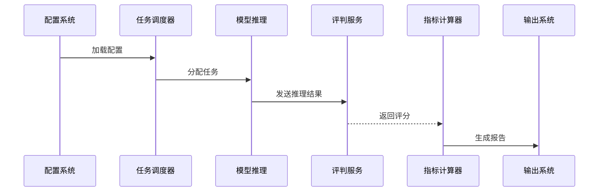
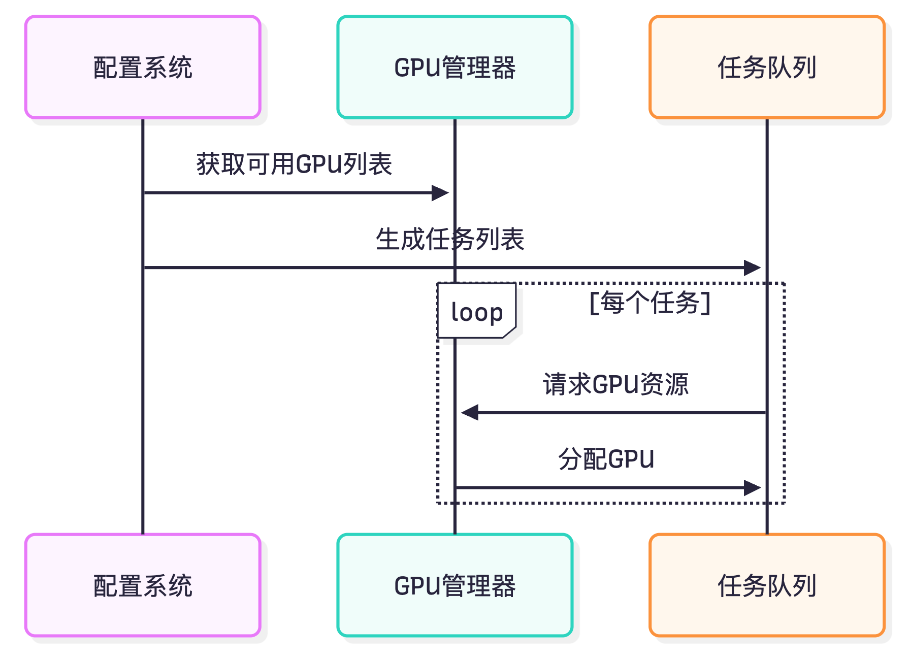

# <h1 align="center">⚡️BytevalKit_LLM: 一站式 LLM 评测工具</h1>

<p align="center">
    <a href="https://github.com/BytevalKit/BytevalKit_LLM">
        
    </a>
    <a href="https://github.com/BytevalKit/BytevalKit_LLM">
        
    </a>
    <a href="https://github.com/BytevalKit/BytevalKit_LLM/blob/master/LICENSE">
        
    </a>
    <a href="https://github.com/BytevalKit/BytevalKit_LLM/releases">
        
    </a>
</p>

<h4 align="center">
    <p>
        <a href="#概述">概述</a> |
        <a href="#核心特性">核心特性</a> |
        <a href="#安装">安装</a> |
        <a href="#快速开始">快速开始</a> |
        <a href="#配置说明">配置说明</a> |
        <a href="#系统架构">系统架构</a> |
        <a href="#benchmark">评测结果</a> |
        <a href="#贡献指南">贡献指南</a> |
        <a href="#许可证">许可证</a>
    <p>
</h4>

[English](ReadMe.md) | [中文](README_zh_CN.md)

## 概述

BytevalKit_LLM 是一个专为评估大型语言模型（LLM）性能而设计的综合评测框架。它通过声明式 YAML 配置实现评测任务的全流程定制化，支持多种模型部署方式（API、Transformer、vLLM），并提供完整的"推理-评判-评分"自动化工作流。

本框架采用"配置即代码"（Configuration-as-Code）的设计理念，将模型架构、推理逻辑、评估方法、指标计算等关键环节抽象为可配置项，使定制化的评测任务能够通过修改 YAML 配置文件实现，而非重复的代码开发。

## 核心特性

### 🚀 多模式支持
- **API 模式**：支持OpenAI 接口的 LLM 服务调用
- **本地推理**：支持基于 Transformer 架构的模型加载与推理
- **vLLM 加速**：集成 vLLM 高性能推理引擎
- **批量处理**：支持批量推理和并发评测

### 🎯 灵活的评测方式
- **规则评判**：支持自定义规则进行结果评判
- **LLM-as-Judge**：支持使用 LLM 作为评判器
- **CoT 评测**：支持思维链（Chain-of-Thought）推理过程评估
- **多维度评估**：支持多个维度综合评测，同时也支持用户过滤掉不需要的维度

### 📊 数据格式支持
- JSON / JSONL 格式
- CSV 格式
- 用户可以根据demo/dataset/目录下的示例数据自行实现数据预处理


### ⚡ 高效执行
- GPU 资源智能分配
- 多任务并行执行


## 安装

### 环境要求
- Python 3.9+
- CUDA 11.8+（使用 GPU 推理时需要）

### 安装步骤

```bash
# 克隆仓库
git clone https://github.com/BytevalKit/BytevalKit_LLM.git
cd BytevalKit_LLM

# 安装依赖
pip install -r requirements.txt
```

## 快速开始

### 基础用法

```bash
# 使用默认配置运行评测
python3 main.py --yaml_path demo/demo.yaml

# 运行 csv的数据集评测参考
python3 main.py --yaml_path demo/cmmlu.yaml

# 运行多任务评测
python3 main.py --yaml_path demo/multi_task_gpu_invocation.yaml
```

### 示例配置

我们在 `demo/` 目录下提供了多个示例配置：
- `demo/Qwen2.5-1.5B-Instruct.yaml` - 本地模型推理示例
- `demo/cot_model_eval.yaml` - CoT 思维链评测示例
- `demo/single_model_vllm_inference_eval.yaml` - vLLM 推理示例
- `demo/multi_task_gpu_invocation.yaml` - 多任务并行示例

## 配置说明

### YAML 配置结构

配置文件包含三个主要部分：

#### 1. DEFAULT - 任务配置
```yaml
DEFAULT:
  work_dir: /path/to/output        # 输出目录
  task_name: my_eval_task          # 任务名称
  need_judge: true                 # 是否需要评判
  need_calculate: true             # 是否计算最终得分
  need_cot_judge: true            # 是否评测 CoT 思维链
  use_vllm: true                  # 是否使用 vLLM
  batch_size: 10                  # 批量大小
  judge_workers: 10               # 评判并发数
  vllm_cfg:
    max_seq_len: 16384
    max_out_len: 2048
```

#### 2. DATASET - 数据集配置
```yaml
DATASET:
  my_dataset:
    name: dataset_display_name
    path: /path/to/dataset.json
    question_key: input           # 问题字段名（默认: input）
    answer_key: target           # 答案字段名（默认: target）
    judge_type: rule_comparison  # 评判类型：rule_comparison 或 llm_judge
    
    # 自定义数据预处理
    exec_code: |+
      question = item['question'] + " 选项: " + str(item['options'])
      answer = item['answer']
    
    # 自定义评判规则（rule_comparison 时使用）
    judge_code: |+
      import re
      match = re.search(r'答案是\s*([A-D])', item.prediction)
      if match:
          judge_result = match.group(1) == item.answer
    
    # LLM 评判提示词（llm_judge 时使用）
    judge_prompt: "请评判以下回答的质量..."
    
    # 评估维度过滤
    filter_key: ["清晰度", "完备性"]  # 仅保留指定维度
```
exec_code执行位置为：prompt_format.py中get_infer_list函数
judge_code的执行位置为：judge.py中exact_match函数
#### 3. MODEL - 模型配置
```yaml
MODEL:
  # API 模型示例
  gpt4:
    type: api
    name: gpt-4
    api_key: ${API_KEY}
    
  # 本地模型示例
  qwen2_5:
    type: vllm  # 或不指定，默认使用 transformers
    name: Qwen2.5-7B-Instruct
    path: /path/to/model
    model_kwargs:
      torch_dtype: bfloat16
      trust_remote_code: true
    meta_template:
      SYSTEM_begin: "<|im_start|>system\n"
      SYSTEM_end: "<|im_end|>\n"
      HUMAN_begin: "<|im_start|>user\n"
      HUMAN_end: "<|im_end|>\n"
      BOT_begin: "<|im_start|>assistant\n"
      BOT_end: "<|im_end|>\n"
```

## 系统架构

### 执行流程

<details>
<summary>查看执行流程图</summary>


</details>

### 架构图
<p align="center">
    <a href="assets/architecture_zh-CN.png">
        
    </a>
</p>
<p align="center"><i>点击图片查看大图</i></p>


### 目录结构


```
BytevalKit_LLM/
├── main.py              # 主入口
├── models/              # 模型接口
│   ├── api_model.py     # API 模型接口
│   ├── hf_model.py      # Huggingface 模型
│   └── vllm_model.py    # vLLM 模型
├── execute/             # 执行引擎
│   ├── infer.py          # 推理模块
│   ├── judge.py           # 评判模块
│   └── task.py            # 任务管理
├── demo/                # 示例配置和数据
    ├── dataset/         # 示例数据集
    └── *.yaml          # 示例配置文件

```

## Benchmark

> 注意：为了表明我们的框架适用于开源数据集的评测方式，我们使用开源模型在部分评测集进行框架验证，使用的评测逻辑均为LLM评测

> 以下仅为框架评测结果，模型无先后顺序


| Dataset | Metric | Qwen3_32B | qwen3-14b | qwen3-235b<br>-a22b | DeepSeek-V3-671B | qwen1.7B-instruct | Qwen3_8B | Qwen2.5_1.5B | Qwen2.5_7B |
|---------|--------|-----------|-----------|---------------------|------------------|-------------------|----------|--------------|------------|
| AIME24 | acc | 33.33 | 26.67 | 46.67 | 33.3 | 16.67 | 23.3 | 3.33 | 13.3 |
| AIME25 | acc | 20 | 23.33 | 27.5 | 25.83 | 7.5 | 8.33 | 0 | 15.42 |
| C-SimpleQA | acc | 40.12 | 37.21 | 54.39 | 58.79 | 13.67 | 31.85 | 12.56 | 23.43 |
| MATH-500 | acc | 75.4 | 75.8 | 87.8 | 71.6 | 71.2 | 83 | 55.8 | 77.8 |
| bbh | acc | 87.39 | 84.59 | 88.81 | 87.01 | 55 | 80.3 | 36.2 | 64.3 |
| ceval-gen | acc | 84.77 | 82.8 | 85.78 | 90 | 53.8 | 76.3 | 54.23 | 73.99 |
| cmmlu-gen | acc | 73.33 | 77.9 | 82.49 | 79.2 | 53.13 | 75.82 | 66.28 | 73.73 |
| hellaswag-gen | acc | 81.1 | 54.4 | 84.48 | 82.6 | 61 | 70.3 | 56.25 | 69.6 |
| GPQA-Diamond | acc | 54 | 54.55 | 62.63 | 48.48 | 26.77 | 40.4 | 30.3 | 34.4 |
| MMLU-Pro | acc | 72.86 | 67.14 | 78.58 | 78.57 | 41.43 | 74.3 | 32.14 | 62.85 |


### 数据集说明

感谢以下开源数据集的贡献，我们已将格式化后的版本放置在 `demo/dataset/` 目录下：
- AIME2024
- C-SimpleQA
- MATH-500
- bbh
- ceval-gen
- cmmlu-gen
- hellaswag
- GPQA-Diamond
- MMLU-Pro

## 自定义扩展


### 自定义 LLM Judge
修改 `execute/judge.py`，的llm_judge函数实现您的评判逻辑。

### 并发优化
在评判模块中加入并发请求能力，可显著提升评测速度。

## 贡献

该项目由BytevalKit团队开发，开发成员：

```
{Peijie Bu, Yan Qiu, Shenwei Huang}, Yaling Mou, Xianxian Ma, 
Ming Jiang, Haizhen Liao, Jingwei Sun, Binbin Xing

{*} Equal Contributions.
```

我们也感谢抖音应用算法团队的支持：

```
Xusheng Wang, Fubang Zhao, Jianhui Pang, Mingsi Ye, Jie Tang, Kang Yang, Xiaopu Wang, Shuang Zeng
Fei Jiang, Ying Ju, Chuang Fan, Chuwei Luo, Qingsong Liu, Xu Chen
Yi Lin, Junfeng Yao, Chao Feng, Jiao Ran
```

以及产品设计和Byteval平台侧提供的支持：

```
Ziyu Shi, Zhao Lin, Yang Li, Jing Yang, Zhen Wang, Guojun Ma
```

以及AI platform团队的成员:

```
Huiyu Yu, Lin Dong, Yong Zhang
```

我们欢迎各种形式的贡献！请查看我们的[贡献指南](CONTRIBUTING.md)了解详情。

特别感谢 [OpenCompass](https://github.com/open-compass/opencompass) 提供的开源框架，为我们提供了宝贵的设计思路。

## 引用

如果您在研究中使用了 BytevalKit_LLM，请引用：

```bibtex
@misc{BytevalKit-LLM-2025,
  title={BytevalKit-LLM: Comprehensive LLM Evaluation Framework},
  author={BytevalKit},
  year={2025},
  howpublished={\url{https://github.com/BytevalKit/BytevalKit_LLM}}
}
```

## 许可证

BytevalKit-LLM 使用 [Apache License 2.0](LICENSE) 许可证。

## 联系我们

如有任何问题，欢迎联系我们：BytevalKit@bytedance.com