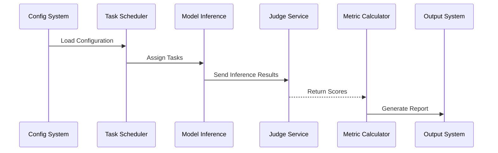
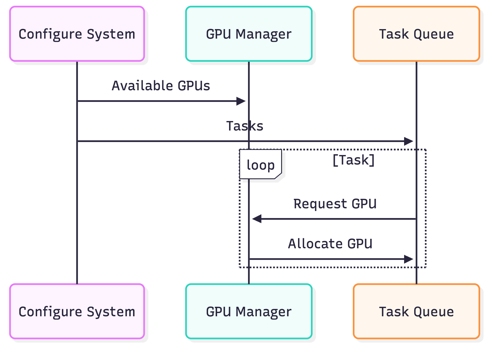

# <h1 align="center">⚡️BytevalKit_LLM: One-Stop LLM Evaluation Tool</h1>

<p align="center">
    <a href="https://github.com/BytevalKit/BytevalKit_LLM">
        
    </a>
    <a href="https://github.com/BytevalKit/BytevalKit_LLM">
        
    </a>
    <a href="https://github.com/BytevalKit/BytevalKit_LLM/blob/master/LICENSE">
        
    </a>
    <a href="https://github.com/BytevalKit/BytevalKit_LLM/releases">
        
    </a>
</p>

<h4 align="center">
    <p>
        <a href="#overview">Overview</a> |
        <a href="#key-features">Key Features</a> |
        <a href="#installation">Installation</a> |
        <a href="#quick-start">Quick Start</a> |
        <a href="#configuration">Configuration</a> |
        <a href="#system-architecture">System Architecture</a> |
        <a href="#benchmark">Benchmark</a> |
        <a href="#contributing">Contributing</a> |
        <a href="#license">License</a>
    <p>
</h4>

[English](ReadMe.md) | [中文](README_zh_CN.md)

## Overview

BytevalKit_LLM is a comprehensive evaluation framework designed to assess the performance of Large Language Models (LLMs). It enables full-process customization of evaluation tasks through declarative YAML configuration, supports multiple model deployment methods (API, Huggingface, vLLM), and provides a complete "inference-evaluation-scoring" automated workflow.

The framework adopts a "Configuration-as-Code" design philosophy, abstracting key components such as model architecture, inference logic, evaluation methods, and metric calculations into configurable items. This allows differences between evaluation tasks to be implemented by modifying YAML configuration files rather than repetitive code development.

## Key Features

### 🚀 Multi-Mode Support
- **API Mode**: OpenAI API-compatible LLM inference service
- **Local Inference**: Supports Transformer-based model loading and inference
- **vLLM Acceleration**: Integration with vLLM high-performance inference engine
- **Batch Processing**: Support for batch inference and concurrent evaluation

### 🎯 Flexible Evaluation Methods
- **Rule-based Evaluation**: Supports custom rule-based evaluation for result judgment
- **LLM-as-Judge**: Support for using LLMs as evaluators
- **CoT Evaluation**: Support for Chain-of-Thought reasoning process evaluation
- **Multi-dimensional Assessment**: Support for dimensions like "user requirement satisfaction, clarity, completeness, factual correctness, strict accuracy"

### 📊 Data Format Support
- JSON / JSONL format
- CSV format
- Custom data preprocessing (via exec_code)
- Direct import from Hugging Face datasets

### ⚡ Efficient Execution
- Intelligent GPU resource allocation
- Multi-task parallel execution
- Support for checkpoint resumption

## Installation

### Requirements
- Python 3.9+
- CUDA 11.8+ (required for GPU inference)

### Installation Steps

```bash
# Clone repository
git clone https://github.com/BytevalKit/BytevalKit_LLM.git
cd BytevalKit_LLM

# Install dependencies
pip install -r requirements.txt
```

## Quick Start

### Basic Usage

```bash
# Run evaluation with default configuration
python3 main.py --yaml_path demo/demo.yaml

# Run CMMLU evaluation
python3 main.py --yaml_path demo/cmmlu.yaml

# Run multi-task evaluation
python3 main.py --yaml_path demo/multi_task_gpu_invocation.yaml
```

### Example Configurations

We provide multiple example configurations in the `demo/` directory:
- `demo/Qwen2.5-1.5B-Instruct.yaml` - Local model inference example
- `demo/cot_model_eval.yaml` - CoT chain-of-thought evaluation example
- `demo/single_model_vllm_inference_eval.yaml` - vLLM inference example
- `demo/multi_task_gpu_invocation.yaml` - Multi-task parallel example

## Configuration

### YAML Configuration Structure

Configuration files contain three main sections:

#### 1. DEFAULT - Task Configuration
```yaml
DEFAULT:
  work_dir: /path/to/output        # Output directory
  task_name: my_eval_task          # Task name
  need_judge: true                 # Whether evaluation is needed
  need_calculate: true             # Whether to calculate final scores
  need_cot_judge: true            # Whether to evaluate CoT chain-of-thought
  use_vllm: true                  # Whether to use vLLM
  batch_size: 10                  # Batch size
  judge_workers: 10               # Number of judge workers
  vllm_cfg:
    max_seq_len: 16384
    max_out_len: 2048
```

#### 2. DATASET - Dataset Configuration
```yaml
DATASET:
  my_dataset:
    name: dataset_display_name
    path: /path/to/dataset.json
    question_key: input           # Question field name (default: input)
    answer_key: target           # Answer field name (default: target)
    judge_type: rule_comparison  # Judge type: rule_comparison or llm_judge
    
    # Custom data preprocessing
    exec_code: |+
      question = item['question'] + " Options: " + str(item['options'])
      answer = item['answer']
    
    # Custom evaluation rules (for rule_comparison)
    judge_code: |+
      import re
      match = re.search(r'The answer is\s*([A-D])', item.prediction)
      if match:
          judge_result = match.group(1) == item.answer
    
    # LLM judge prompt (for llm_judge)
    judge_prompt: "Please evaluate the quality of the following response..."
    
    # Evaluation dimension filtering
    filter_key: ["clarity", "completeness"]  # Keep only specified dimensions
```

#### 3. MODEL - Model Configuration
```yaml
MODEL:
  # API model example
  gpt4:
    type: api
    name: gpt-4
    api_key: ${API_KEY}
    
  # Local model example
  qwen2_5:
    type: vllm  # Or unspecified, defaults to transformers
    name: Qwen2.5-7B-Instruct
    path: /path/to/model
    model_kwargs:
      torch_dtype: bfloat16
      trust_remote_code: true
    meta_template:
      SYSTEM_begin: "<|im_start|>system\n"
      SYSTEM_end: "<|im_end|>\n"
      HUMAN_begin: "<|im_start|>user\n"
      HUMAN_end: "<|im_end|>\n"
      BOT_begin: "<|im_start|>assistant\n"
      BOT_end: "<|im_end|>\n"
```

## System Architecture

### Execution Flow

<details>
<summary>View Flow Diagram</summary>


</details>

### Architecture Diagram

<p align="center">
   <a href="assets/architecture.png">
       
   </a>
</p>
<p align="center"><i>Click image to view larger size</i></p>

### Directory Structure

```
BytevalKit_LLM/
├── main.py              # Main entry point
├── models/              # Model interfaces
│   ├── api_model.py     # API model interface
│   ├── hf_model.py      # Huggingface models
│   └── vllm_model.py    # vLLM models
├── execute/             # Execution engine
│   ├── infer.py           # Inference module
│   ├── judge.py           # Evaluation module  
│   └── task.py            # Task management
├── demo/                # Example configs and data
    ├── dataset/         # Example datasets
    └── *.yaml          # Example configuration files

```

## Benchmark

> Note: To demonstrate that our framework is applicable to open-source dataset evaluation methods, we validate our framework using open-source models on selected evaluation sets, with all evaluation logic based on LLM evaluation.

> The following are framework evaluation results only, with models listed in no particular order.

| Dataset | Metric | Qwen3_30B | Qwen3-14B | Qwen3-235b<br>-a22b | DeepSeek-V3-671B | Qwen1.7B-instruct | Qwen3_8B | Qwen2.5_1.5B | Qwen2.5_7B |
|-------|--------|-----------|-----------|------------------|------------------|-------------------|----------|--------------|------------|
| AIME24 | acc    | 33.33     | 26.67     | 50               | 33.3             | 16.67             | 23.3     | 3.33         | 13.3       |
| AIME25 | acc    | 20        | 23.33     | 27.5             | 25.83            | 7.5               | 8.33     | 0            | 15.42      |
| C-SimpleQA | acc    | 62.27     | 59.92     | 54.39            | 58.79            | 13.67             | 31.85    | 12.56        | 23.43      |
| MATH-500 | acc    | 86.04     | 87.29     | 87.8             | 71.6             | 71.2              | 83       | 55.8         | 77.8       |
| bbh | acc    | 87.39     | 84.59     | 88.81            | 87.01            | 55                | 80.3     | 36.2         | 64.3       |
| ceval-gen | acc    | 84.77     | 82.8      | 85.78            | 90               | 53.8              | 76.3     | 54.23        | 73.99      |
| cmmlu-gen | acc    | 82.58     | 77.9      | 82.49            | 79.2             | 53.13             | 75.82    | 66.28        | 73.73      |
| hellaswag-gen | acc    | 80.61     | 79.27     | 84.48            | 79.05            | 61                | 70.3     | 56.25        | 69.6       |
| GPQA-Diamond | acc    | 54        | 54.55     | 62.63            | 48.48            | 26.77             | 40.4     | 30.3         | 34.4       |
| MMLU-Pro | acc    | 72.86     | 67.14     | 78.57            | 78.57            | 41.43             | 74.3     | 32.14        | 62.85      |


### Dataset Acknowledgments

We thank the following open-source datasets for their contributions. Formatted versions are available in the `demo/dataset/` directory:
- AIME2024
- C-SimpleQA
- MATH-500
- bbh
- ceval-gen
- cmmlu-gen
- hellaswag
- GPQA-Diamond
- MMLU-Pro

## Custom Extensions

### Adding API Models
Modify the `models/api_model.py` file to add your API interface implementation.

### Custom LLM Judge
Modify `execute/judge.py`adjust 'llm_judge' to implement your evaluation logic.

### Concurrency Optimization
Adding concurrent request capabilities to the evaluation module can significantly improve evaluation speed.

## Contributing

This project is developed by the BytevalKit team, development members:

```
{Peijie Bu, Yan Qiu, Shenwei Huang}, Yaling Mou, Xianxian Ma, 
Ming Jiang, Haizhen Liao, Jingwei Sun, Binbin Xing

{*} Equal Contributions.
```

We also thank the Bytedance Douyin Content Team for their support:

```
Xusheng Wang, Fubang Zhao, Jianhui Pang, Mingsi Ye, Jie Tang, Kang Yang, Xiaopu Wang, Shuang Zeng
Fei Jiang, Ying Ju, Chuang Fan, Chuwei Luo, Qingsong Liu, Xu Chen
Yi Lin, Junfeng Yao, Chao Feng, Jiao Ran
```

And the support provided by Product design and Byteval platform team:

```
Ziyu Shi, Zhao Lin, Yang Li, Jing Yang, Zhen Wang, Guojun Ma
```

And from AI platform team:

```
Huiyu Yu, Lin Dong, Yong Zhang
```

We welcome contributions of all kinds! Please check our [Contributing Guide](CONTRIBUTING.md) for details.

Special thanks to [OpenCompass](https://github.com/open-compass/opencompass) for their open-source framework, which provided valuable design insights.

## Citation

If you use BytevalKit_LLM in your research, please cite:

```bibtex
@misc{BytevalKit-LLM-2025,
  title={BytevalKit-LLM: Comprehensive LLM Evaluation Framework},
  author={BytevalKit},
  year={2025},
  howpublished={\url{https://github.com/BytevalKit/BytevalKit_LLM}}
}
```

## License

BytevalKit-LLM is licensed under the [Apache License 2.0](LICENSE).

## Contact Us

If you have any questions, feel free to contact us at: BytevalKit@bytedance.com